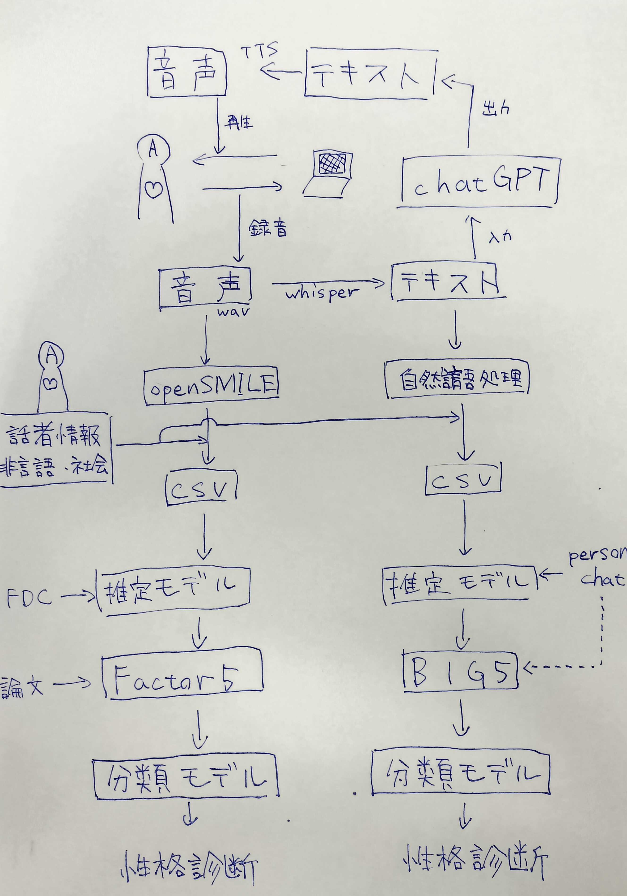

# AgentSpeaksToKnowYou
大学のオープンキャンパスで出す見せ物として作った、音声会話から性格診断するシステムです。

<!-- image or gif -->

## Overview
早稲田大学のオープンキャンパスの出し物として、菊池研究室から出展したものの一つ。
全体としては、来場者がchatGPTと簡単な会話をし、結果として来場者の性格を診断し、楽しんでもらうというもの。
このレポジトリでは、本システムそのものや、その構築に利用したデータの一部が保存される。

## Requirement
プログラムの実行に必要なライブラリ等は`requirements.txt`に記載してあります。
また、実行環境はM2 Macbookのみで動作確認しています。

## Usage
first time:
```bash
git clone ***
cd ***
```
```bash
export OPENAI_API_KEY='<your_api_key here>'
```
```bash
python3 -m venv venv
source venv/bin/activate
pip install -r requirements.txt
mkdir csvs user_audios user_texts system_audios system_texts

python3 gui_audio_chat.py
```

after that:
```bash
python3 gui_audio_chat.py
```

## Features
1. 性格診断に用いられるデータが、雑多な日常会話であること
1. テキストと音声のそれぞれから性格診断をしていること

## Reference
- api
	- [OpenAI-API](https://openai.com/index/openai-api/)
- dataset
	- [RealPersonaChat](https://github.com/nu-dialogue/real-persona-chat)
	- FDC
- paper
	- 山住賢司, 籠宮隆之, 槙洋一, & 前川喜久雄. (2005). 講演音声の印象評価尺度. 日本音響学会誌, 61(6), 303-311. [link](https://www.jstage.jst.go.jp/article/jasj/61/6/61_KJ00003301328/_pdf#page=1.00)
	- 小塩真司, & 阿部晋吾. (2012). 日本語版 Ten Item Personality Inventory (TIPI-J) 作成の試み. パーソナリティ研究, 21(1), 40-52. [link](https://www.jstage.jst.go.jp/article/personality/21/1/21_40/_pdf/-char/ja)

## Author
- 宮澤 快
- 天神原 正大
- 小出 采依
- (super thanks to 西村茉鈴)

## Licence
later ...

---
# 再現性担保について (後輩 他 へ)
このプロジェクトは、大学のオープンキャンパスで出す見せ物として作った、音声会話から性格診断するシステムです。
LLM技術を中心に、音声認識技術、合成音声技術、機械学習による推定を組み合わせて、性格診断を行っています。
具体的には、以下の図のようなイメージです。

<div style="text-align: center;">
	
</div>

## How To Make This Project
このプロジェクトを再現するためには、以下の手順を踏む必要があります。

#### 1. 音声会話システムの構成要素を理解する
- 音声認識技術 (Whisper)
- 合成音声技術 (TTS)
- 大規模言語モデル含む自然言語処理 (GPT)
- [詳しくはこちら](./documents/audio_chat.md)

#### 2. 性格診断に用いるデータの収集方法を理解する
- FDC
- real persona chat
- アンケート質問調査
- [詳しくはこちら](./documents/dataset.md)

#### 3. 特徴量抽出と機械学習による性格推定を理解する
- 音声的特徴量の抽出 (openSMILE)
- 言語的特徴量の抽出 (形態素解析 MeCab, 他)
- lightGBM
- [詳しくはこちら](./documents/prediction.md)

#### 4. システム全体の構築方法を理解する
- 1~3の技術を組み合わせたシステムの構築
- GUI (PyQt5)
- [詳しくはこちら](./documents/system.md)

#### 5. コードを書く
- 実際のコードのコメントアウトを読みつつ、理解する
- なんとなく理解したら、自分でコードを書いてみる
- 雑なスパゲッティコードなので、もっとシンプルに書けると思います。工夫のしどころです。
- [実際のコードはこちら](./gui_audio_chat.py)