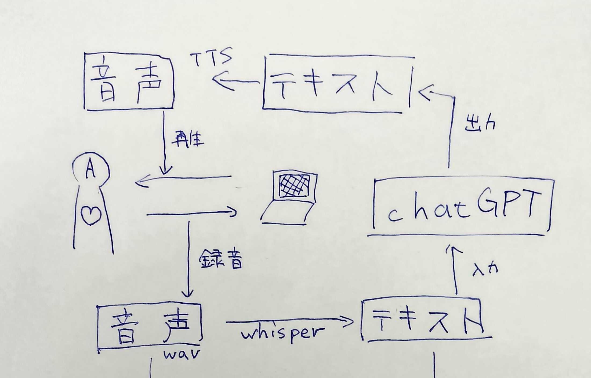

# 音声会話システムの構成要素を理解する

1. 音声会話システムの構成要素を理解する
1. [性格診断に用いるデータの収集方法を理解する](./dataset.md)
1. [特徴量抽出と機械学習による性格推定を理解する](./prediction.md)
1. [システム全体の構成方法を理解する](./system.md)
1. [実際のコードはこちら](../gui_audio_chat.py)

今回のプログラムで用いた音声会話システムは、2024年7月現在chatGPTのモバイルアプリ等で利用できる音声会話モードと内部的な処理はほぼ同じだと思われます。実際、音声会話システム部分だけに絞って比較すれば、タイムラグや音声の声色など、差異を認知することはほぼできないと思います。
具体的には、以下の図のようなイメージです。

	

## 音声認識技術 Whisper
音声認識とは、人が話している音声に対し、どんな言葉が発せられているのかを認識する技術です。要は、入力が音声、出力が文字で、出力の文字は音声の内容と一致していることが求められます。音声認識技術は、音声会話システムの中核技術であり、音声会話システムの性能は、この音声認識技術の性能に大きく依存します。

[Whisper](https://openai.com/index/introducing-chatgpt-and-whisper-apis/) は、OpenAI が提供する音声認識技術です。Whisper は、Transformerによる深層学習を用いて音声認識が行われ、高い精度で音声を文字に変換します。また、音声認識の速度も速く、ほぼリアルタイムでの音声認識にも対応しています。言語指定や精度指定(速さとトレードオフ)ができ、柔軟で、かつAPIを利用した簡単な利用方法で音声認識ができます。

## 合成音声技術 TTS (Text to Speech)
合成音声技術とは、文字を音声に変換する技術です。要は、入力が文字、出力が音声で、出力の音声は入力の文字に対応していることが求められます。合成音声技術は、初音ミクやSiri、ずんだもんなど、音声合成ソフトウェアや音声アシスタントに使われています。

[TTS](https://platform.openai.com/docs/guides/text-to-speech) は、OpenAI が提供する合成音声技術です。TTS は、Transformerによる深層学習を用いて音声合成が行われ、高い自然さで音声を生成します。また、音声合成の速度も速く、ほぼリアルタイムでの音声合成にも対応しています。声色の選択肢もいくつか用意されており、APIを利用した簡単な利用方法で音声合成ができます。

## 大規模言語モデル含む自然言語処理 chatGPT
大規模言語モデルとは、大量のテキストデータを用いて学習された言語モデルのことです。要は、入力がテキスト、出力もテキストで、出力のテキストは入力のテキストに(文脈の整合性として)対応していることが求められます。大規模言語モデルは、文章の生成や文章の分類、文章の要約など、自然言語処理の様々なタスクに使われています。2024年7月現在、chatGPTが最も有名です。

[chatGPT](https://platform.openai.com/docs/guides/chat-completions) は、OpenAI が提供する大規模言語モデルです。chatGPT は、Transformerによる深層学習を用いて自然言語処理が行われ、高い自然さでテキストを生成します。また、テキスト生成の速度も速く、ほぼリアルタイムでのテキスト生成にも対応しています。2024年7月現在、chatGPTやLlamaなどは多くのチャットボットなどに利用されています。

next: [性格診断に用いるデータの収集方法を理解する](./dataset.md)