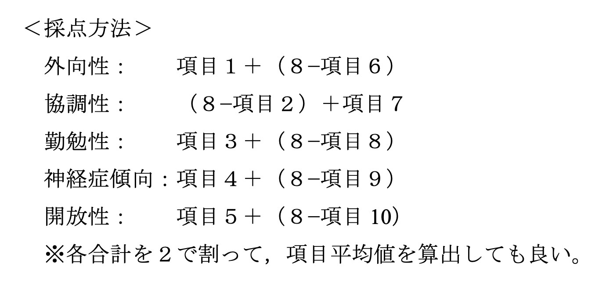

## 出力を出す過程に関するメモ
### アンケート結果の処理
- アンケート結果から回答者ごとにBigFiveの得点を算出

    - 
### テキストデータの結びつけ
1. それぞれの回答者のBigFiveの得点を抽出
2. 入力のBigFiveとのコサイン類似度が高い回答者上位3名を抽出
3. 上位3名の回答者の文章に対する共感の平均値を算出
4. 共感の平均値が最も高い文章を最終的な出力とする
### 音声データの結びつけ
- 入力のFactor5とのコサイン類似度が最も高い文章を出力とする